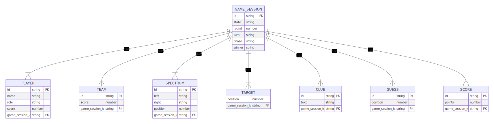

[//]: # (This file is only used by the `npm run docs command` to generate the README.md file. Do not edit README.md directly.)

# Phaselock Design Documentation

> A web adaptation of [Wavelength](https://www.wavelength.zone/) by Wolfgang Warsch, Alex Hague, and Justin Vickers.

## Game Overview

Phaselock is an online multiplayer party game where players try to read each other's minds. The game is divided into teams, and each turn, one player (the "operator") receives a prompt with two opposite/related sides of a spectrum, and a secret pre-selected position within that spectrum (the "target"). The operator gives a clue (a single concept or idea) which aims to guide their team to the target position on the spectrum. The closer the team's guess to the target, the more points they score.

## Game Flow

## Technical Overview

### Frontend

#### Technologies

- Next.js framework for out-of-the-box optimization features and React project bootstrapping.
- TypeScript for type safety and improved development experience.
- Tailwind CSS for rapid UI development and personal styling preference.
- Radix UI (w/ customized shadcn/ui templates) for accessible and customizable UI components.
- Socket.io-client for real-time, bidirectional communication with the server.

#### Components

- Game Lobby: For creating, joining games, and setting up teams.
- Spectrum Display: Visually represents the spectrum and the team's guess.
- Clue Submission: Input for the operator to submit their clue.
- Guess Mechanism: Interface for the team to submit their guess on the spectrum.

### Backend Architecture

This app utilizes Next.js's API routes with a Socket.io server for real-time game state updates. The server is responsible for managing game sessions, handling client connections, and broadcasting game state changes. TypeScript is used to ensure type safety and a unified development experience across the stack.

#### Game Session Management

Handles creation, joining, and management of game sessions. Tracks players, teams, and game state.

#### Player Management

Tracks player states, roles (operator, guessers), and turns.

#### Game State Management

Manages the current spectrum, target, clues, guesses, and scoring.

#### Security Considerations

- Data Validation: Strictly validate all client inputs to prevent injection attacks and ensure game integrity.

#### Development Considerations

- Use modern React features (hooks, context) for efficient state management and component reusability.
- Employ WebSocket for real-time game updates, ensuring a lively and engaging player experience.
- Implement robust error handling and connection recovery mechanisms to handle disconnects or network issues gracefully.

## Data Model ERD

## Class Diagram

## Development Roadmap

### Phase 1: MVP

- [] WebSocket connection between clients and server.
- [] Game creation and joining (including game ID generation)
- [] Team setup
- [] Game start conditions
- [] Score tracking
- [] Random spectrum generation w/o repeats
- [] Random target generation
- [] Clue submission and broadcast
- [] Guess submission and scoring
- [] Round management
- [] Game end conditions
- [] Winner announcement

### Stretch Goals

- [] Re-roll generated spectrum if the operator doesn't like it
- [] Custom spectrum list option in game creation
- [] Spectator mode
